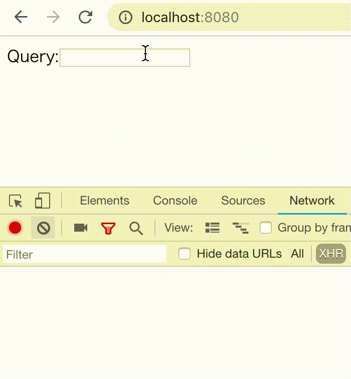

react-hooks-async
=================

[](https://travis-ci.com/dai-shi/react-hooks-async)
[](https://badge.fury.io/js/react-hooks-async)
[](https://bundlephobia.com/result?p=react-hooks-async)

An abortable async function library by React Hooks

Motivation
----------

JavaScript promises are not abortable/cancelable.
However, DOM provides AbortController which can be
used for aborting promises in general.

This is an experimental library to provide an easy
way to handle async function by React Hooks API.

Install
-------

```bash
npm install react-hooks-async
```

Usage
-----

A typeahead search example.



```javascript
import React, { useCallback, useState } from 'react';

import {
  useAsyncCombineSeq,
  useAsyncRun,
  useAsyncTaskFetch,
  useAsyncTaskTimeout,
} from 'react-hooks-async';

const GitHubSearch = ({ query }) => {
  const url = `https://api.github.com/search/repositories?q=${query}`;
  const timeoutTask = useAsyncTaskTimeout(useCallback(() => true, [query]), 500);
  const fetchTask = useAsyncTaskFetch(url);
  const combinedTask = useAsyncCombineSeq(timeoutTask, fetchTask);
  useAsyncRun(query && combinedTask);
  if (!query) return null;
  if (timeoutTask.pending) return <div>Waiting...</div>;
  if (fetchTask.error) return <Err error={fetchTask.error} />;
  if (fetchTask.pending) return <Loading abort={fetchTask.abort} />;
  if (!fetchTask.result) return <div>No result</div>;
  return (
    <ul>
      {fetchTask.result.items.map(({ id, name, html_url }) => (
        <li key={id}><a target="_blank" href={html_url}>{name}</a></li>
      ))}
    </ul>
  );
};

const App = () => {
  const [query, setQuery] = useState('');
  return (
    <div>
      Query:
      <input value={query} onChange={e => setQuery(e.target.value)} />
      <GitHubSearch query={query} />
    </div>
  );
};
```

Example
-------

The [examples](examples) folder contains working examples.
You can run one of them with

```bash
PORT=8080 npm run examples:minimal
```

and open <http://localhost:8080> in your web browser.

You can also try them in codesandbox.io:
[01](https://codesandbox.io/s/github/dai-shi/react-hooks-async/tree/master/examples/01_minimal)
[02](https://codesandbox.io/s/github/dai-shi/react-hooks-async/tree/master/examples/02_typescript)
[03](https://codesandbox.io/s/github/dai-shi/react-hooks-async/tree/master/examples/03_startbutton)
[04](https://codesandbox.io/s/github/dai-shi/react-hooks-async/tree/master/examples/04_typeahead)
[05](https://codesandbox.io/s/github/dai-shi/react-hooks-async/tree/master/examples/05_axios)
[06](https://codesandbox.io/s/github/dai-shi/react-hooks-async/tree/master/examples/06_progress)
[07](https://codesandbox.io/s/github/dai-shi/react-hooks-async/tree/master/examples/07_race)

Reference
---------

TODO

Blogs
-----

- [Introduction to abortable async functions for React with hooks](https://medium.com/@dai_shi/introduction-to-abortable-async-functions-for-react-with-hooks-768bc72c0a2b)
